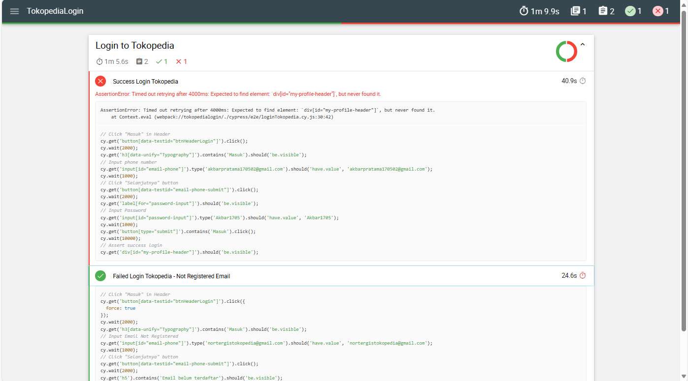

# How To Run Cypress Test Case

## Clone or Pull Repository

1. Ensure already install nodejs and npm
2. Clone/Pull this repository
3. Open Terminal/CMD, type `npm install` and enter. It will install dependencies based on package.json file
4. After installing progress done, node_modules folders will be created
5. Add new files in root folder that names cypress.env.json to store your environment variables for `EMAIL` and `PASSWORD`
6. Write in cypress.env.json file like this and save it

   ```json
   {
     "EMAIL": "yourEmail",
     "PASSWORD": "yourPassword"
   }
   ```

## Run Test Case at Cypress UI

1. Type `npx cypress open` to open cypress menu
2. After cypress menu opened, choose End to End (E2E) Testing
3. Choose a browser that you want to use, preffered to choose Google Chrome
4. Select automation script file that you want to run and script will be run

## Run Test Case at Headless Mode

1. Type `npx cypress run` to run cypress at headless mode
2. Wait until test run is done
3. Review test result

## Run Test Case at Headless Mode and Generate Report

1. Type `npx cypress run --reporter mochawesome` to run cypress at headless mode and generate report mochawesome
2. Wait until test run is done and mochawesome-report folder is generated
3. Open mochawesome-report folder at it has my-report.html and my-report.json
4. Open my-report.html with Open Live Server to shown HTML page
   
5. Evaluate the result based on mochawesome report
